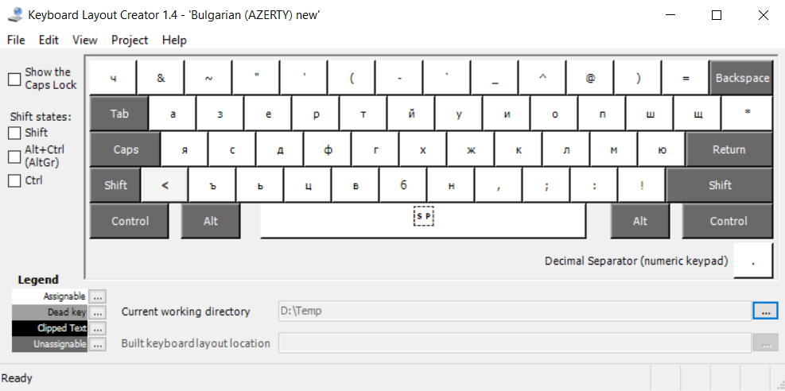
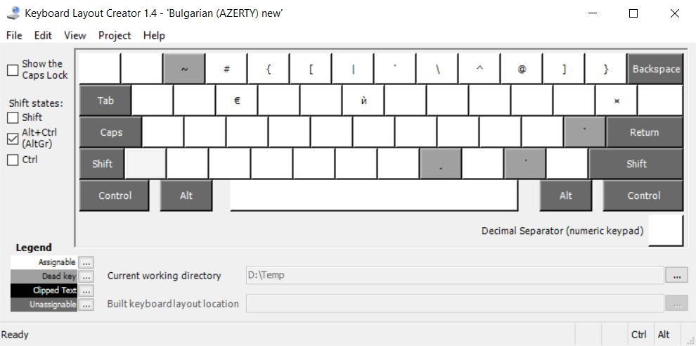
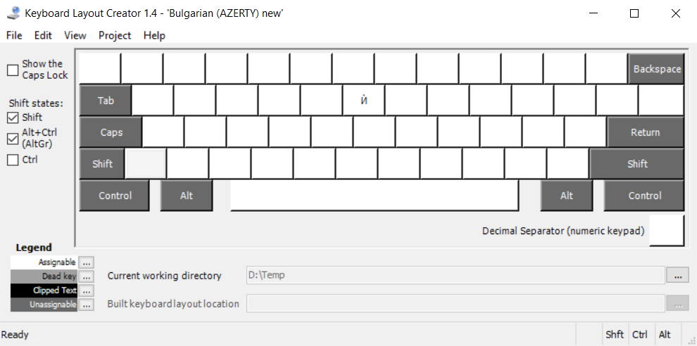

# bgazerty

Bulgarian phonetic keyboard layout with Franch (France) AZERTY-like layout.

## How I did it

In [Keyboard Layout Creator 1.4](https://www.microsoft.com/en-us/download/details.aspx?id=102134):
1. I opened an existing keyboard layout: `File` » `Load Existing Keyboard...` » `French (France)`.
2. I added to the system the Bulgarian (Bulgaria) phonetic layout.
3. I modified the keyboard to obtain the following layout:
    
    
    
    

**Warning:** The Microsoft Keyboard Layout Creator application dates from 2007. It still works perfectly and works under Windows 10, but you may encounter a bug.

## How to install the driver

### Using the pre-compiled installation

You can find the driver installation on the [releases page](https://github.com/kpym/bgazerty/releases/latest). You run the `setup.exe`. And finally in the Windows settings you choose the keyboard`Bulgarian AZERTY`.

### By generating the installation yourself

1. Install [Keyboard Layout Creator 1.4](https://www.microsoft.com/en-us/download/details.aspx?id=102134).
2. Retrieve the source code of the keyboard [bgazerty.klc](bgazerty.klc).
3. Generate the installation files with `Projects` » `Build DLL and Setup Package`.
4. Proceed with the installation as described above (run the `setup.exe`).

## License

[MIT](LICENSE)